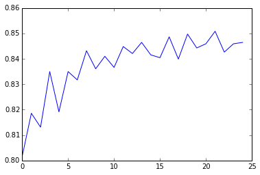

## Assignment Introduction and Interpretation

"""
In this example above, I have defined response variable as Regular Smoking, and have considered all the explanatory variables (e.g. Age, Gender, race or any experience of being expelled from the school, etc.) in the dataset based on the answers to the question "Have you ever smoked cigarettes regularly (at least 1 sigrette smoked per day for continous 30 days)?".

I first divided the data set into 60%-40% Train and Test datasets. Then I called a no. of libraries from Python for various statistical analysis.

Following is the result of confusion matrix:
array([[1442,   60],
       [ 221,  107]])
    True Negative: 1442
    True Positive: 107
    False Negative: 221
    False Positive: 60
    
Accuracy in Prediction is found out to be: 0.85

Then, based upon important feature criterion and different tree sizes, we ran a 25 tree ensemble of random forest to see the effect of that on accuracy of prediction. Following are the results (in according to the variables listed in our features set):

Valiables
['BIO_SEX','HISPANIC','WHITE','BLACK','NAMERICAN','ASIAN','age', 'ALCEVR1','ALCPROBS1','marever1','cocever1','inhever1','cigavail','DEP1','ESTEEM1','VIOL1',
'PASSIST','DEVIANT1','SCHCONN1','GPA1','EXPEL1','FAMCONCT','PARACTV','PARPRES']

Importance Score
[ 0.02382876  0.01613692  0.02854005  0.01522122  0.00650991  0.00479691
  0.06520711  0.06125229  0.04963882  0.09714242  0.0236702   0.0163416
  0.02974558  0.06092194  0.05644238  0.05270618  0.01703965  0.06279687
  0.06335496  0.06838091  0.01305733  0.06334959  0.05330749  0.05061092]
  
As we can see the highest importance score is 0.09714242 for variable 'marever1' (i.e. use of Marijuana)
and lowest score is 0.00479691 for variable 'ASIAN' (i.e. Ethinicity Asian)

Finally, in the plot of accuracies of different trees, as we can see, single tree is giving accuracy for about 83% while all other climb to maximum of 85% accuracy. This gives us some confidence that it may be perfectly appropriate to interpret single decision tree for this data, given that it's accuracy is quite near to that successive trees in the forest.
"""

## Python Code and Program Output

### Call the libraries


```python
from pandas import Series, DataFrame
import pandas as pd
import numpy as np
import os
import matplotlib.pylab as plt
from sklearn.cross_validation import train_test_split
from sklearn.tree import DecisionTreeClassifier
from sklearn.metrics import classification_report
import sklearn.metrics
```


```python
# Feature Importance
from sklearn import datasets
from sklearn.ensemble import ExtraTreesClassifier
```


```python
# set directory
os.chdir("C:\Anaconda\Coursera\RandomForest")
```


```python
#Load the dataset
AH_data = pd.read_csv("tree_addhealth.csv")
```


```python
# Clean the data, remove NAs
data_clean = AH_data.dropna()
```


```python
# Data types
data_clean.dtypes
```


    BIO_SEX      float64
    HISPANIC     float64
    WHITE        float64
    BLACK        float64
    NAMERICAN    float64
    ASIAN        float64
    age          float64
    TREG1        float64
    ALCEVR1      float64
    ALCPROBS1      int64
    marever1       int64
    cocever1       int64
    inhever1       int64
    cigavail     float64
    DEP1         float64
    ESTEEM1      float64
    VIOL1        float64
    PASSIST        int64
    DEVIANT1     float64
    SCHCONN1     float64
    GPA1         float64
    EXPEL1       float64
    FAMCONCT     float64
    PARACTV      float64
    PARPRES      float64
    dtype: object


```python
# description of data set
data_clean.describe()
```


<div>
<table border="1" class="dataframe">
  <thead>
    <tr style="text-align: right;">
      <th></th>
      <th>BIO_SEX</th>
      <th>HISPANIC</th>
      <th>WHITE</th>
      <th>BLACK</th>
      <th>NAMERICAN</th>
      <th>ASIAN</th>
      <th>age</th>
      <th>TREG1</th>
      <th>ALCEVR1</th>
      <th>ALCPROBS1</th>
      <th>...</th>
      <th>ESTEEM1</th>
      <th>VIOL1</th>
      <th>PASSIST</th>
      <th>DEVIANT1</th>
      <th>SCHCONN1</th>
      <th>GPA1</th>
      <th>EXPEL1</th>
      <th>FAMCONCT</th>
      <th>PARACTV</th>
      <th>PARPRES</th>
    </tr>
  </thead>
  <tbody>
    <tr>
      <th>count</th>
      <td>4575.000000</td>
      <td>4575.000000</td>
      <td>4575.000000</td>
      <td>4575.000000</td>
      <td>4575.000000</td>
      <td>4575.000000</td>
      <td>4575.000000</td>
      <td>4575.000000</td>
      <td>4575.000000</td>
      <td>4575.000000</td>
      <td>...</td>
      <td>4575.000000</td>
      <td>4575.000000</td>
      <td>4575.000000</td>
      <td>4575.000000</td>
      <td>4575.000000</td>
      <td>4575.000000</td>
      <td>4575.000000</td>
      <td>4575.000000</td>
      <td>4575.000000</td>
      <td>4575.000000</td>
    </tr>
    <tr>
      <th>mean</th>
      <td>1.521093</td>
      <td>0.111038</td>
      <td>0.683279</td>
      <td>0.236066</td>
      <td>0.036284</td>
      <td>0.040437</td>
      <td>16.493052</td>
      <td>0.176393</td>
      <td>0.527432</td>
      <td>0.369180</td>
      <td>...</td>
      <td>40.952131</td>
      <td>1.618579</td>
      <td>0.102514</td>
      <td>2.645027</td>
      <td>28.360656</td>
      <td>2.815647</td>
      <td>0.040219</td>
      <td>22.570557</td>
      <td>6.290710</td>
      <td>13.398033</td>
    </tr>
    <tr>
      <th>std</th>
      <td>0.499609</td>
      <td>0.314214</td>
      <td>0.465249</td>
      <td>0.424709</td>
      <td>0.187017</td>
      <td>0.197004</td>
      <td>1.552174</td>
      <td>0.381196</td>
      <td>0.499302</td>
      <td>0.894947</td>
      <td>...</td>
      <td>5.381439</td>
      <td>2.593230</td>
      <td>0.303356</td>
      <td>3.520554</td>
      <td>5.156385</td>
      <td>0.770167</td>
      <td>0.196493</td>
      <td>2.614754</td>
      <td>3.360219</td>
      <td>2.085837</td>
    </tr>
    <tr>
      <th>min</th>
      <td>1.000000</td>
      <td>0.000000</td>
      <td>0.000000</td>
      <td>0.000000</td>
      <td>0.000000</td>
      <td>0.000000</td>
      <td>12.676712</td>
      <td>0.000000</td>
      <td>0.000000</td>
      <td>0.000000</td>
      <td>...</td>
      <td>18.000000</td>
      <td>0.000000</td>
      <td>0.000000</td>
      <td>0.000000</td>
      <td>6.000000</td>
      <td>1.000000</td>
      <td>0.000000</td>
      <td>6.300000</td>
      <td>0.000000</td>
      <td>3.000000</td>
    </tr>
    <tr>
      <th>25%</th>
      <td>1.000000</td>
      <td>0.000000</td>
      <td>0.000000</td>
      <td>0.000000</td>
      <td>0.000000</td>
      <td>0.000000</td>
      <td>15.254795</td>
      <td>0.000000</td>
      <td>0.000000</td>
      <td>0.000000</td>
      <td>...</td>
      <td>38.000000</td>
      <td>0.000000</td>
      <td>0.000000</td>
      <td>0.000000</td>
      <td>25.000000</td>
      <td>2.250000</td>
      <td>0.000000</td>
      <td>21.700000</td>
      <td>4.000000</td>
      <td>12.000000</td>
    </tr>
    <tr>
      <th>50%</th>
      <td>2.000000</td>
      <td>0.000000</td>
      <td>1.000000</td>
      <td>0.000000</td>
      <td>0.000000</td>
      <td>0.000000</td>
      <td>16.509589</td>
      <td>0.000000</td>
      <td>1.000000</td>
      <td>0.000000</td>
      <td>...</td>
      <td>40.000000</td>
      <td>0.000000</td>
      <td>0.000000</td>
      <td>1.000000</td>
      <td>29.000000</td>
      <td>2.750000</td>
      <td>0.000000</td>
      <td>23.700000</td>
      <td>6.000000</td>
      <td>14.000000</td>
    </tr>
    <tr>
      <th>75%</th>
      <td>2.000000</td>
      <td>0.000000</td>
      <td>1.000000</td>
      <td>0.000000</td>
      <td>0.000000</td>
      <td>0.000000</td>
      <td>17.679452</td>
      <td>0.000000</td>
      <td>1.000000</td>
      <td>0.000000</td>
      <td>...</td>
      <td>45.000000</td>
      <td>2.000000</td>
      <td>0.000000</td>
      <td>4.000000</td>
      <td>32.000000</td>
      <td>3.500000</td>
      <td>0.000000</td>
      <td>24.300000</td>
      <td>9.000000</td>
      <td>15.000000</td>
    </tr>
    <tr>
      <th>max</th>
      <td>2.000000</td>
      <td>1.000000</td>
      <td>1.000000</td>
      <td>1.000000</td>
      <td>1.000000</td>
      <td>1.000000</td>
      <td>21.512329</td>
      <td>1.000000</td>
      <td>1.000000</td>
      <td>6.000000</td>
      <td>...</td>
      <td>50.000000</td>
      <td>19.000000</td>
      <td>1.000000</td>
      <td>27.000000</td>
      <td>38.000000</td>
      <td>4.000000</td>
      <td>1.000000</td>
      <td>25.000000</td>
      <td>18.000000</td>
      <td>15.000000</td>
    </tr>
  </tbody>
</table>
<p>8 rows × 25 columns</p>
</div>


### Split into training and testing sets


```python
# Selector the Predictors
predictors = data_clean[['BIO_SEX','HISPANIC','WHITE','BLACK','NAMERICAN','ASIAN','age',
'ALCEVR1','ALCPROBS1','marever1','cocever1','inhever1','cigavail','DEP1','ESTEEM1','VIOL1',
'PASSIST','DEVIANT1','SCHCONN1','GPA1','EXPEL1','FAMCONCT','PARACTV','PARPRES']]
```


```python
# Select Target Variable (Ever Smpked: 1 = Yes, 2 = No)
targets = data_clean.TREG1

# Have you ever smoked cigarettes regularly (1/day for 30 days)?
```


```python
# Creating Training and Test (60%, 40%) sets
pred_train, pred_test, tar_train, tar_test  = train_test_split(predictors, targets, test_size=.4)
```


```python
# Look at the shapes
print "Shape of Train Set: ", pred_train.shape
print "Shape of Test Set: ",  pred_test.shape
print "Shape of Train Set (Target): ", tar_train.shape
print "Shape of Train Set (Target): ", tar_test.shape

```

    Shape of Train Set:  (2745, 24)
    Shape of Test Set:  (1830, 24)
    Shape of Train Set (Target):  (2745L,)
    Shape of Train Set (Target):  (1830L,)
    

### Build model on training data


```python
# import RF Module from SKLearn
from sklearn.ensemble import RandomForestClassifier
```


```python
classifier=RandomForestClassifier(n_estimators=25)
classifier=classifier.fit(pred_train,tar_train)
```


```python
predictions=classifier.predict(pred_test)
```


```python
# Confusion Matrix
sklearn.metrics.confusion_matrix(tar_test,predictions)
```


    array([[1442,   60],
           [ 221,  107]])


```python
# Accuracy Score
sklearn.metrics.accuracy_score(tar_test, predictions)
```


    0.84644808743169397


```python
# fit an Extra Trees model to the data
model = ExtraTreesClassifier()
model.fit(pred_train,tar_train)
```


    ExtraTreesClassifier(bootstrap=False, class_weight=None, criterion='gini',
               max_depth=None, max_features='auto', max_leaf_nodes=None,
               min_samples_leaf=1, min_samples_split=2,
               min_weight_fraction_leaf=0.0, n_estimators=10, n_jobs=1,
               oob_score=False, random_state=None, verbose=0, warm_start=False)


```python
# display the relative importance of each attribute
print(model.feature_importances_)
```

    [ 0.02382876  0.01613692  0.02854005  0.01522122  0.00650991  0.00479691
      0.06520711  0.06125229  0.04963882  0.09714242  0.0236702   0.0163416
      0.02974558  0.06092194  0.05644238  0.05270618  0.01703965  0.06279687
      0.06335496  0.06838091  0.01305733  0.06334959  0.05330749  0.05061092]
    


```python
"""
Running a different number of trees and see the effect
 of that on the accuracy of the prediction
"""

trees=range(25)
accuracy=np.zeros(25)
```


```python
for idx in range(len(trees)):
   classifier=RandomForestClassifier(n_estimators=idx + 1)
   classifier=classifier.fit(pred_train,tar_train)
   predictions=classifier.predict(pred_test)
   accuracy[idx]=sklearn.metrics.accuracy_score(tar_test, predictions)
```


```python
%matplotlib inline
```


```python
plt.cla()
plt.plot(trees, accuracy)
plt.show()
```





```python

```
